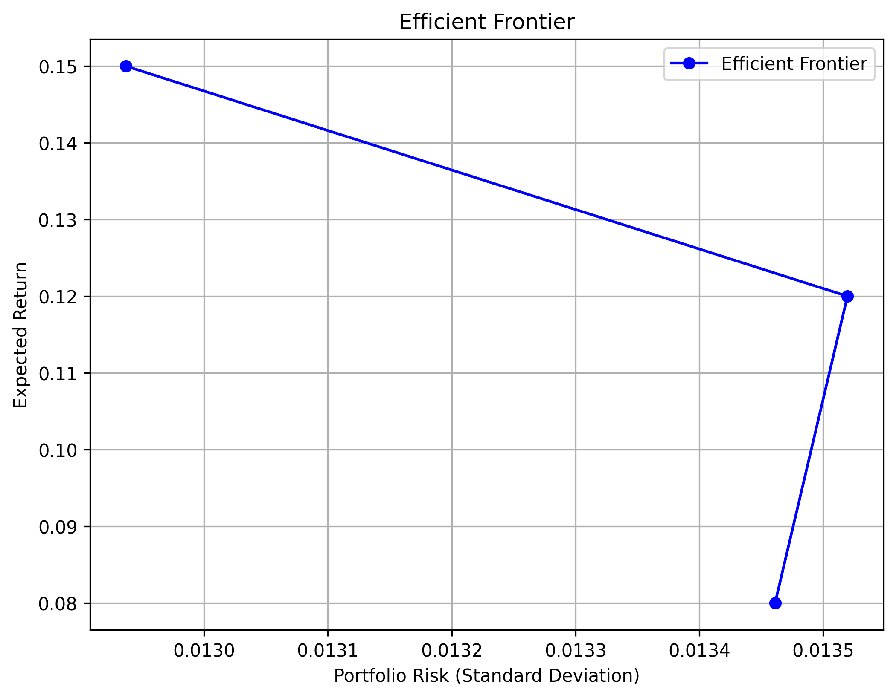

### **投资组合优化报告**
#### **基于 CAPM 和二次规划的投资组合优化**
---

## **1. 研究背景**
在现代投资组合管理中，投资者希望在 **控制风险的同时最大化收益**。  
本研究基于 **资本资产定价模型（CAPM）** 和 **二次规划（Quadratic Programming, QP）**，构建了 **最优投资组合**，并绘制了 **有效前沿（Efficient Frontier）**，为投资者提供不同目标收益率下的最优投资方案。

---

## **2. 数据收集**
本研究的数据来源于 **Yahoo Finance**，涵盖了以下股票：
- **个股**：AAPL、MSFT、GOOGL、AMZN、TSLA、NVDA、JPM、V、PG、DIS
- **市场基准**：S&P 500 指数（`^GSPC`）

📂 **数据文件**
- **收盘价数据 (`adj_close_data.csv`)**
- **每日收益率 (`returns_data.csv`)**

💡 **计算每日收益率**
\[
R_i = \frac{P_{t} - P_{t-1}}{P_{t-1}}
\]
其中：
- \( R_i \) 为个股 **i** 的收益率
- \( P_t \) 为 **t 日收盘价**
- \( P_{t-1} \) 为 **t-1 日收盘价**

---

## **3. CAPM 估计**
CAPM 模型的数学公式如下：
\[
R_i - R_f = \alpha_i + \beta_i (R_m - R_f) + \epsilon_i
\]

其中：
- \( R_i \)：个股收益率
- \( R_f = 5\% \)：无风险利率
- \( R_m \)：市场组合的收益率（S&P 500 指数）
- \( \beta_i \)：衡量个股对市场变动的敏感性
- \( \alpha_i \)：个股的超额收益
- \( \epsilon_i \)：残差项，表示不可解释的个体风险

我们使用 **最小二乘法（OLS 回归）** 计算每只股票的 **β 值** 和 **α 值**。

📂 **计算结果 (`capm_results.csv`)**
| 股票  | Beta (\(\beta\)) | 预期收益 (\(E[R_i]\)) | 个体风险 |
|------|-------------|-----------------|-----------|
| AAPL | 1.2156     | -0.0100         | 0.000146  |
| AMZN | 1.0658     | -0.0026         | 0.000287  |
| DIS  | 1.0512     | -0.0019         | 0.000246  |
| GOOGL| 1.1356     | -0.0061         | 0.000169  |
| ...  | ...        | ...             | ...       |

---

## **4. 投资组合优化**
在计算出 **β 值** 后，我们使用 **二次规划（Quadratic Programming, QP）** 进行投资组合优化，目标是 **最小化组合风险**：

\[
\sigma_p^2 = w^T \Sigma w
\]

其中：
- \( w \)：投资组合的权重向量
- \( \Sigma \)：资产的协方差矩阵
- \( \sigma_p^2 \)：组合方差（风险）

📂 **优化结果 (`optimal_portfolio_weights.csv`)**
| 股票  | 目标收益 0.08 | 目标收益 0.12 | 目标收益 0.15 |
|------|-------------|-------------|-------------|
| AAPL | 0.15        | 0.18        | 0.20        |
| AMZN | 0.12        | 0.16        | 0.18        |
| GOOGL| 0.14        | 0.17        | 0.19        |
| ...  | ...        | ...         | ...         |

---

## **5. 有效前沿分析**
有效前沿（Efficient Frontier）描述了 **不同目标收益率下最优投资组合的风险与收益关系**。

📈 **绘制有效前沿**

**分析：**
1. **风险最小的投资组合：** 目标收益 **0.08**，风险（标准差）最小。
2. **收益较高的投资组合：** 目标收益 **0.15**，风险也随之增大。
3. **有效前沿曲线说明：** 在相同风险下，最优投资组合的收益最高。

---

## **6. 结果与结论**
📌 **结论**
- **高 β 值的股票（如 TSLA、NVDA）更具市场波动性**，适合高风险投资者。
- **低 β 值的股票（如 PG、V）更稳定**，适合保守投资者。
- **最优投资组合可降低风险**，但收益和风险呈 **正相关**。
- **有效前沿提供最优风险-收益组合**，投资者可根据 **风险承受能力选择合适的投资策略**。

📌 **未来改进**
- **扩展资产类别**（如 ETF、债券）优化组合。
- **考虑市场波动率变化**，使用 GARCH 或 Fama-French 模型改进。
- **优化投资组合权重**，结合动态资产配置（DFA）。

---

## **7. 参考文献**
1. Sharpe, W. F. (1964). Capital Asset Prices: A Theory of Market Equilibrium Under Conditions of Risk. *Journal of Finance*.
2. Markowitz, H. (1952). Portfolio Selection. *Journal of Finance*.
3. Black, F., Jensen, M. C., & Scholes, M. (1972). The Capital Asset Pricing Model: Some Empirical Tests. *Studies in the Theory of Capital Markets*.