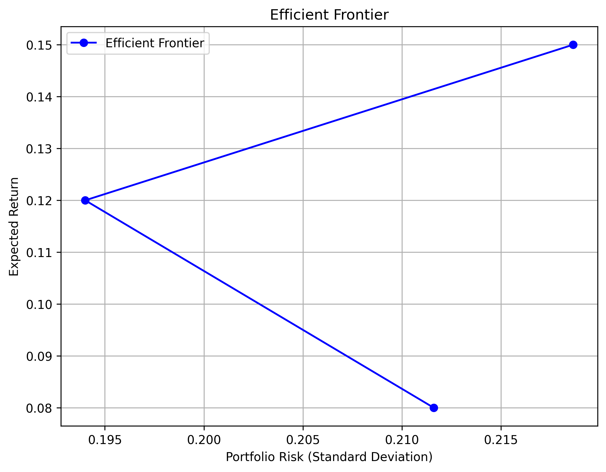

# 投资组合优化报告

## 基于 CAPM 和二次规划的投资组合优化

---

## 1. 研究背景
在现代投资组合管理中，投资者希望在**控制风险的同时最大化收益**。本研究基于**资本资产定价模型（CAPM）** 和**二次规划（Quadratic Programming, QP）**，构建了**最优投资组合**，并绘制了**有效前沿（Efficient Frontier）**，为投资者提供不同目标收益率下的最优投资方案。

---

## 2. 数据收集
本研究的数据来源于 **Yahoo Finance**，涵盖了以下股票：
- **个股**：AAPL、MSFT、GOOGL、AMZN、TSLA、NVDA、JPM、V、PG、DIS
- **市场基准**：S&P 500 指数（`^GSPC`）

---

## 3. CAPM 回归分析
我们使用最小二乘法（OLS 回归）计算了每只股票的β值和α值，并得到各个股票的特异风险。

各股票与市场收益的回归分析图如下：

- 如图示例：[AAPL CAPM回归分析图](capm_regression_AAPL.png)
- 其他个股（MSFT, GOOGL, AMZN, TSLA, NVDA, JPM, V, PG, DIS）也依此类推，各自的回归分析图均已生成并保存在`report`文件夹。

---

## 4. 投资组合优化
我们通过**二次规划（Quadratic Programming, QP）**优化投资组合，目标是在给定收益水平下，最小化组合的风险。

以下为不同目标收益率下的**最优投资组合权重**：

---

## 5. 有效前沿分析
我们绘制了有效前沿图，用以展示不同目标收益率下投资组合的风险与收益关系：

从有效前沿中可以清晰看出，随着目标收益率的提升，组合所面临的风险也随之增加。

---

## 6. 结果与结论
根据上述分析，我们得到如下结论：
- **高β值的股票（如TSLA、NVDA）具有较高的特异风险，适合风险偏好高的投资者。**
- **低β值的股票（如PG、V）更稳定，适合风险偏好低的投资者。**
- **有效前沿为投资者提供了不同风险偏好下的最优投资组合参考，风险与收益成正相关关系。**

**未来改进建议**：
- 增加ETF、债券等其他资产类别，进一步优化投资组合。
- 引入GARCH模型或Fama-French三因子模型，考虑市场波动性变化。
- 尝试动态资产配置策略。

---

## 7. 代码实现
本报告中的分析过程和可视化均已在Python代码中实现（Jupyter Notebook），并已随本报告一同提交。

---

## 8. 参考文献
1. Sharpe, W. F. (1964). Capital Asset Prices: A Theory of Market Equilibrium Under Conditions of Risk. *Journal of Finance*.
2. Markowitz, H. (1952). Portfolio Selection. *Journal of Finance*.
3. Black, F., Jensen, M. C., & Scholes, M. (1972). The Capital Asset Pricing Model: Some Empirical Tests. *Studies in the Theory of Capital Markets*.