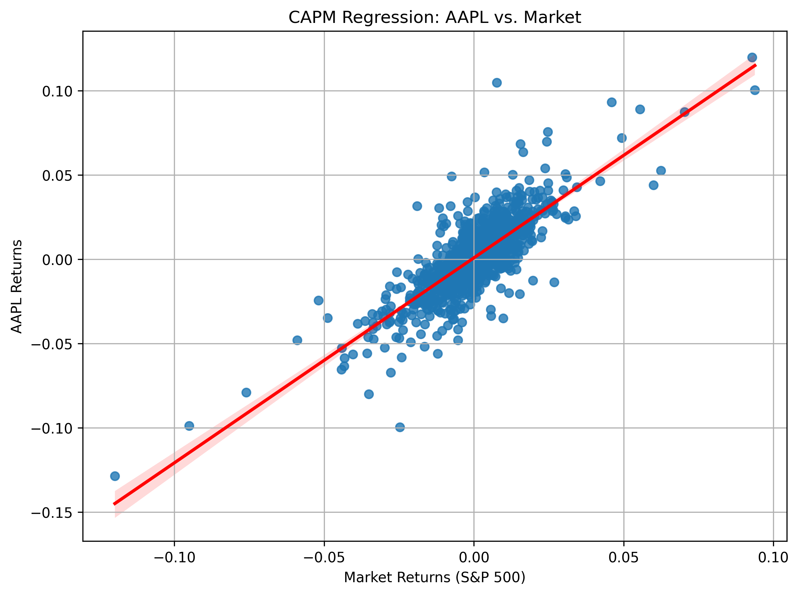

# 投资组合优化报告

## 基于CAPM与二次规划的投资组合优化

---

## 1. 研究背景
在现代投资组合管理中，投资者的目标是**在控制风险的同时最大化收益**。本研究基于**资本资产定价模型（CAPM）**和**二次规划（QP）**构建了**最优投资组合**，并绘制了**有效前沿（Efficient Frontier）**，为投资者提供不同目标收益率下的最佳投资策略。

---

## 2. 数据收集
本研究数据来自**雅虎财经（Yahoo Finance）**，涵盖以下股票：
- **股票**：AAPL, MSFT, GOOGL, AMZN, TSLA, NVDA, JPM, V, PG, DIS
- **市场基准**：标普500指数（`^GSPC`）

收集的数据包括：
- 调整后的收盘价格数据（`adj_close_data.csv`）
- 日收益数据（`returns_data.csv`）

每日收益的计算公式为：

$$
R_i = \frac{P_{t} - P_{t-1}}{P_{t-1}}
$$

其中：
- $R_i$：资产$i$的收益率
- $P_t$：第$t$日的收盘价
- $P_{t-1}$：第$t-1$日的收盘价

---

## 3. CAPM回归分析
我们使用**普通最小二乘法（OLS回归）**计算每只股票的**β（beta）和α（alpha）值**，并获得各资产的**特异风险**。

CAPM回归模型定义为：

$$
R_i - R_f = \alpha_i + \beta_i (R_m - R_f) + \epsilon_i
$$

其中：
- $R_i$：资产$i$的收益率
- $R_f = 0.02$：无风险收益率
- $R_m$：市场收益率（标普500指数收益率）
- $\alpha_i$：超额收益的截距项
- $\beta_i$：资产$i$对市场变动的敏感性
- $\epsilon_i$：残差项

使用β计算每个资产的预期收益：

$$
\mu_i = R_f + \beta_i(E[R_m] - R_f)
$$

其中：
- $E[R_m]$ 为观察期内的平均市场收益率。

**特异风险**指市场波动无法解释的风险部分，定义为：

$$
\text{特异风险} = Var(\epsilon_i)
$$

股票与市场收益的回归分析图示例如下：

- **AAPL CAPM回归分析：**

*(其他股票的回归图已在提供的文件夹中)*

**特异风险柱状图：**

---

## 4. 投资组合优化
我们使用**二次规划（QP）**进行投资组合优化，目标是在给定的预期收益水平下最小化投资组合风险。数学表达式为：

最小化投资组合风险：

$$
\min_{w} \sigma_p^2 = w^T \Sigma w
$$

约束条件：

$$
\sum_{i=1}^{N} w_i = 1,\quad \sum_{i=1}^{N} w_i \mu_i = \mu_p, \quad 0 \leq w_i \leq 1
$$

其中：
- $w$ 为资产权重向量。
- $\Sigma$ 为资产收益的协方差矩阵。
- $\sigma_p^2$ 为投资组合方差（风险）。
- $\mu_p$ 为目标收益率。
- $w_i$ 为资产$i$的投资权重。

不同目标收益率下的**最优投资组合权重**如下图所示：

---

## 5. 有效前沿分析
我们绘制了**有效前沿**图，以展示不同目标收益水平下投资组合的风险与收益关系：

从有效前沿图可明显看出，随着目标收益率的增加，投资组合相关联的风险也随之增加。

---

## 6. 结果与结论
基于以上分析，我们得到以下结论：
- **高β值股票（如TSLA、NVDA）表现出较高的特异风险，适合风险偏好较高的投资者。**
- **低β值股票（如PG、V）更稳定，适合风险规避型投资者。**
- **有效前沿为投资者在不同风险偏好下提供了最优的投资组合策略，显示风险与收益之间的正相关关系。**

**未来的改进建议：**
- 增加ETF、债券等资产类别，进一步优化投资组合。
- 引入**GARCH模型**或**Fama-French三因子模型**以考虑市场波动的变化。
- 探索**动态资产配置策略**。

---

## 7. 代码实现
本报告中的分析过程和可视化使用Python（Jupyter Notebook）实现，随报告一同提交。

---

## 8. 参考文献
1. Sharpe, W. F. (1964). Capital Asset Prices: A Theory of Market Equilibrium Under Conditions of Risk. *Journal of Finance*.
2. Markowitz, H. (1952). Portfolio Selection. *Journal of Finance*.
3. Black, F., Jensen, M. C., & Scholes, M. (1972). The Capital Asset Pricing Model: Some Empirical Tests. *Studies in the Theory of Capital Markets*.

