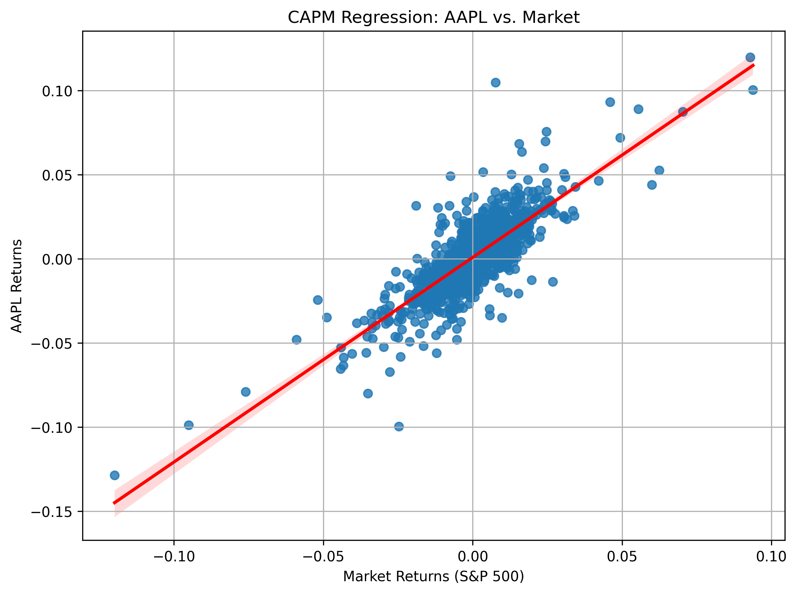
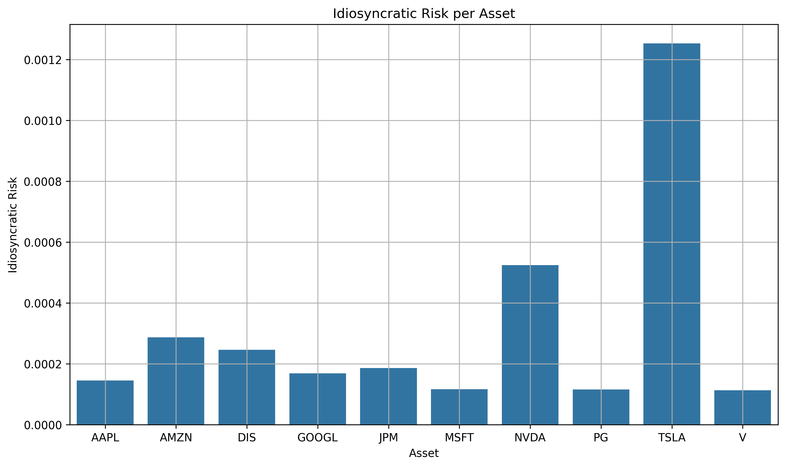
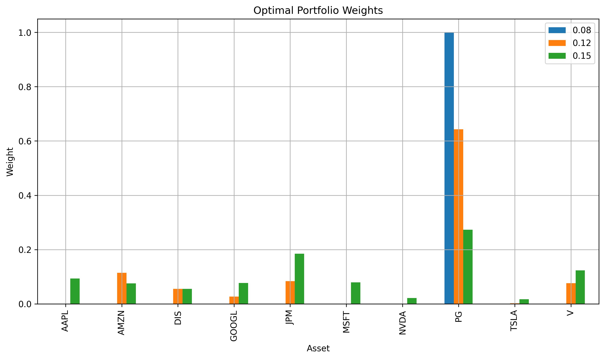

# Portfolio Optimization Report

## Optimization of Portfolio Based on CAPM and Quadratic Programming

---

## 1. Research Background
In modern portfolio management, investors aim to **maximize returns while controlling risk**. This study is based on the **Capital Asset Pricing Model (CAPM)** and **Quadratic Programming (QP)** to construct an **optimal investment portfolio** and draw the **Efficient Frontier**, providing investors with the best investment strategy under different target return rates.

---

## 2. Data Collection
The data in this study is sourced from **Yahoo Finance** and covers the following stocks:
- **Stocks**: AAPL, MSFT, GOOGL, AMZN, TSLA, NVDA, JPM, V, PG, DIS
- **Market Benchmark**: S&P 500 Index (`^GSPC`)

The collected data include:
- Adjusted closing price data (`adj_close_data.csv`)
- Daily returns data (`returns_data.csv`)

Daily returns are calculated using the formula:

$$
R_i = \frac{P_{t} - P_{t-1}}{P_{t-1}}
$$

Where:
- $R_i$: Return of asset $i$
- $P_t$: Closing price on day $t$
- $P_{t-1}$: Closing price on day $t-1$

---

## 3. CAPM Regression Analysis
We use **Ordinary Least Squares (OLS) regression** to calculate the **β (beta) and α (alpha) values** for each stock and obtain the **idiosyncratic risk** for each asset.

The CAPM regression model is defined as:

$$
R_i - R_f = \alpha_i + \beta_i (R_m - R_f) + \epsilon_i
$$

Where:
- $R_i$: Return of asset $i$
- $R_f = 0.02$: Risk-free rate
- $R_m$: Market return (S&P 500 index return)
- $\alpha_i$: Intercept representing the excess return
- $\beta_i$: Sensitivity of asset $i$ to market movements
- $\epsilon_i$: Residual term

The expected return of each asset using beta is calculated as:

$$
\mu_i = R_f + \beta_i(E[R_m] - R_f)
$$

Where:
- $E[R_m]$ is the average market return over the observation period.

**Idiosyncratic Risk:** reflects the portion of risk that cannot be explained by market fluctuations and is defined as:

$$
\text{Idiosyncratic Risk} = Var(\epsilon_i)
$$

Regression analysis plots for stocks and market returns are shown below:

- **AAPL CAPM Regression Analysis:**

*(Other stocks' regression plots are similarly available in the provided folder.)*

**Idiosyncratic Risk Bar Chart:**

---

## 4. Portfolio Optimization
We use **Quadratic Programming (QP)** to optimize the portfolio, aiming to minimize portfolio risk at a given level of expected return. The mathematical formulation is:

Minimize portfolio risk:

$$
\min_{w} \sigma_p^2 = w^T \Sigma w
$$

Subject to constraints:

$$
\sum_{i=1}^{N} w_i = 1,\quad \sum_{i=1}^{N} w_i \mu_i = \mu_p, \quad 0 \leq w_i \leq 1
$$

Where:
- $w$ is the asset weight vector.
- $\Sigma$ is the covariance matrix of asset returns.
- $\sigma_p^2$ is the portfolio variance (risk).
- $\mu_p$ is the target return.
- $w_i$ is the investment weight of asset $i$.

The **optimal portfolio weights** for different target return rates are shown below:

---

## 5. Efficient Frontier Analysis
We plot the **Efficient Frontier** to illustrate the relationship between portfolio risk and return at different target return levels:

From the **Efficient Frontier**, it is evident that as the target return increases, the risk associated with the portfolio also increases.

---

## 6. Results and Conclusions
Based on the above analysis, we conclude the following:
- **High-beta stocks (such as TSLA, NVDA) exhibit higher idiosyncratic risk and are suitable for high-risk investors.**
- **Low-beta stocks (such as PG, V) are more stable and suitable for risk-averse investors.**
- **The Efficient Frontier provides investors with an optimal portfolio strategy under different risk preferences, indicating a positive correlation between risk and return.**

**Future Improvement Suggestions:**
- Expand asset classes by including ETFs, bonds, etc., for better portfolio optimization.
- Introduce **GARCH models** or **Fama-French three-factor models** to consider market volatility variations.
- Explore **dynamic asset allocation strategies**.

---

## 7. Code Implementation
The analysis process and visualizations in this report were implemented using Python (Jupyter Notebook) and are included with this report submission.

---

## 8. References
1. Sharpe, W. F. (1964). Capital Asset Prices: A Theory of Market Equilibrium Under Conditions of Risk. *Journal of Finance*.
2. Markowitz, H. (1952). Portfolio Selection. *Journal of Finance*.
3. Black, F., Jensen, M. C., & Scholes, M. (1972). The Capital Asset Pricing Model: Some Empirical Tests. *Studies in the Theory of Capital Markets*.